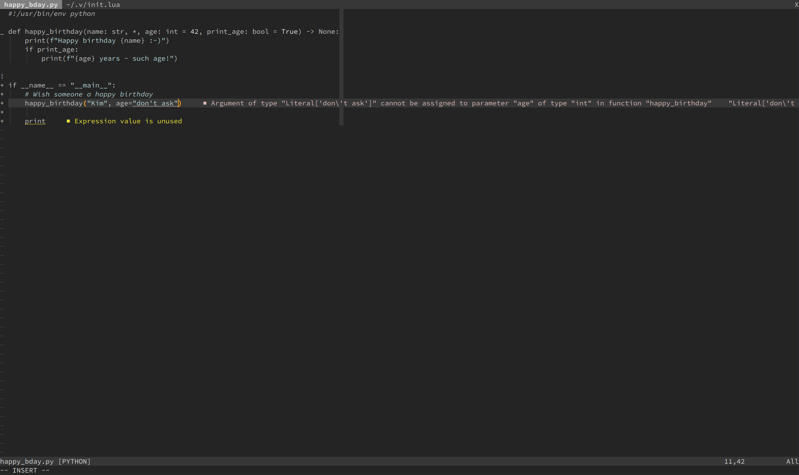

# munu

_munu_ is a (predominantly) monochromatic **GUI-only** colorscheme for Vim/Neovim.

It is for those who prefer _less_.

Things that have color or style:

* strings, numbers, floats and booleans
* comments and todos
* search
* cursor
* messages and diagnostics (errors, warnings, info, etc)
* diffs and git signs
* spelling

Color can be completely turned off or individually changed (see
[Settings](#settings)).

## Screenshot



## Requirements

* true-color terminal
* `set termguicolors` if using Vim

## Installation

[vim-plug](https://github.com/junegunn/vim-plug):

```viml
Plug 'KimNorgaard/munu', { 'as': 'munu' }
```

[packer.nvim](https://github.com/wbthomason/packer.nvim):

```lua
use { 'KimNorgaard/munu', as = 'munu' }
```

[lazy.nvim](https://github.com/folke/lazy.nvim):

```lua
{ 'KimNorgaard/munu', name = 'munu', lazy = true, priority = 1000 },
```

## Usage

```viml
colorscheme munu
```

```lua
vim.cmd [[colorscheme munu]]
```

## Default Palette

| Type           | Value     | Color
|----------------|-----------|------------------------------------------------------
| Background     | `#242424` | 
| Foreground     | `#c8c8c8` | 
| Strings        | `#b8d8d9` | 
| Numbers        | `#ededed` | 
| Floats         | `#ededed` | 
| Booleans       | `#ededed` | 
| Comments       | `#b8d8d9` | 
| Todos          | `#fda424` | 
| Cursor         | `#fda424` | 
| Search         | `#fda424` | 
| Success        | `#c8dab9` | 
| Warnings       | `#f1e637` | 
| Errors         | `#dabab9` | 
| Info           | `#b8d8d9` | 
| DiffAdd        | `#c8dab9` | 
| DiffChange     | `#cbb9da` | 
| DiffDelete     | `#dabab9` | 
| DiffText       | `#b8d8d9` | 
| SpellBad       | `#dabab9` | 
| SpellCap       | `#b8d8d9` | 
| SpellRare      | `#cbb9da` | 
| SpellLocal     | `#c8dab9` | 

## Settings

All settings can be set using `let g:OPTION_NAME = VALUE`, e.g.:

```viml
let g:munu_hl_strings = v:false
let g:munu_col_fg = "#929292"
```

## Options

| Setting | Description | Default
|--------|------------|--------
| munu_hl_enable_colors     | Enable colors              | `v:true`
| munu_hl_strings           | Highlight strings          | `v:true`
| munu_hl_numbers           | Highlight numbers          | `v:true`
| munu_hl_floats            | Highlight floats           | `v:true`
| munu_hl_booleans          | Highlight booleans         | `v:true`
| munu_hl_comments          | Highlight comments         | `v:true`
| munu_hl_todos             | Highlight todos            | `v:true`
| munu_hl_italic_comments   | Italicize comments         | `v:true`
| munu_hl_terminal_colors   | Highlight terminal colors  | `v:true`

## Colors

| Setting | Default
|--------|--------------
| munu_col_bg                | `#242424`
| munu_col_fg                | `#c8c8c8`
| munu_col_strings           | `#b8d8d9`
| munu_col_comments          | `#b8d8d9`
| munu_col_todos             | `#fda424`
| munu_col_numbers           | `#ededed`
| munu_col_floats            | `#ededed`
| munu_col_booleans          | `#ededed`
| munu_col_success           | `#c8dab9`
| munu_col_warnings          | `#f1e637`
| munu_col_errors            | `#dabab9`
| munu_col_info              | `#b8d8d9`
| munu_col_diff_add_fg       | `#373737`
| munu_col_diff_add_bg       | `#c8dab9`
| munu_col_diff_chg_fg       | `#373737`
| munu_col_diff_chg_bg       | `#cbb9da`
| munu_col_diff_del_fg       | `#373737`
| munu_col_diff_del_bg       | `#dabab9`
| munu_col_diff_txt_fg       | `#373737`
| munu_col_diff_txt_bg       | `#b8d8d9`
| munu_col_cursor_fg         | `#373737`
| munu_col_cursor_bg         | `#fda424`
| munu_col_search_fg         | `#373737`
| munu_col_search_bg         | `#fda424`
| munu_col_spell_bad_fg      | `#dabab9`
| munu_col_spell_bad_bg      | `NONE`
| munu_col_spell_cap_fg      | `#b8d8d9`
| munu_col_spell_cap_bg      | `NONE`
| munu_col_spell_rare_fg     | `#cbb9da`
| munu_col_spell_rare_bg     | `NONE`
| munu_col_spell_local_fg    | `#c8dab9`
| munu_col_spell_local_bg    | `NONE`

## License

[](https://opensource.org/licenses/MIT)
